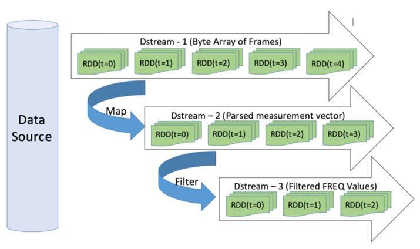
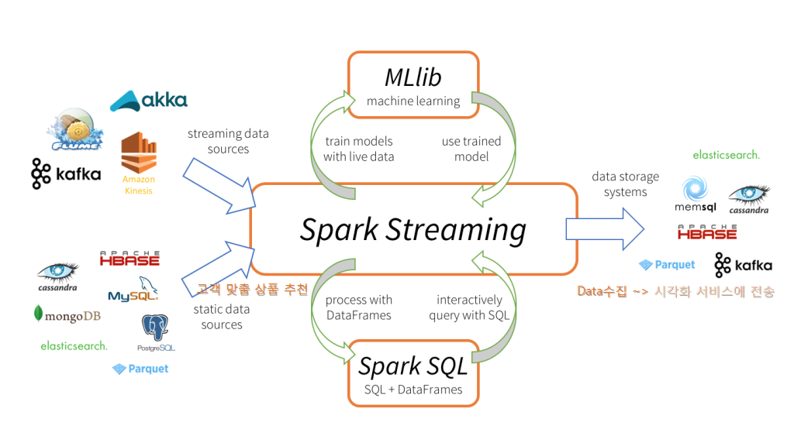

20190904W_Spark`

# Spark_Lec3

# What is the SparkStreaming?

## 1. Stream data

> batch processing : 스토리지에 저장된 데이터를 읽어 특정 처리를 하고, 결과를 다시 스토리지에 저장 (스토리지~데이터입력~>처리~데이터출력~>스토리지)
>
> Stream data : 이미 스토리지에 저장된 하나의 큰 데이터가 아닌 *반 영구적으로 계속해서 생성되는 데이터*

- 짧은 시간 간격으로, 반복적으로 생성
- 바로바로 처리하는 것을 목표
  - 센서, 웹시스템(SNS log), 재고

## 2. Stream processing

> 스트림 데이터를 짧은 간격으로 읽어가며 처리하는 것
>
> 준 실시간으로 처리를 끝내고 결과를 외부에 제공

- MQ(Message Queue) : 획득한 데이터를 효과적으로 스트림처리 시스템에 넘기기 위해 메시징 시스템 이용

### 2.1. 이용 사례

- 센서 데이터의 통계 처리
- 인터넷 콘텐츠 제공 서비스의 최적화
- 사용자의 구매 정보로 구매 경향 분석

## 3. Spark Streaming

> Spark의 고속 배치처리 기능을 이용해 스트림처리를 구현한 라이브러리
>
> 스파크 코어가 제공하는 기능으로 구현, 스파크에 의한 데이터 처리 모델 계승

### 3.1. DStream

> 일정한 간격으로 읽어 들인 데이터셋은 내부적으로 RDD로서 다루어지며, RDD가 연속되는 스트림을 DStream이라고 한다. (RDD로 구성된 sqeunce)

- Spark Streaming은 RDD변환처리로 데이터처리를 구현한다.

- Stream data를 `여러 dataset` 조각으로 나누어 입력 데이터를 구성하고, `반복처리`한다.

- 마지막 데이터를 읽어 들인 시점으로부터 배치 간격에 해당하는 시간동안 새로 생성된 데이터를 읽어 새로운 RDD생성

  

  

- basic data source : 외부 라이브러리 도움 없이 Spark 단독으로 지원 가능 

  - 소켓, 파일 , RDD Queue

- advanced data source

  - Kafka, Flume, Kinesis, twitter

    - Kafka

      > 분산 메시징 시스템
      >
      > 높은 성능과 안정성을 보장한다.

      - Producer : 데이터 제공
      - Consumer : 데이터 사용
      - Broker : 데이터 저장과 관리
        - topic 단위로 데이터 분류, 저장 ~> 여러 partition으로 분리해서 저장 ~> 하나의 파티션이 다수 서버에 복제된다. (*Zookeeper*)
        - KafkaUtils.createStream() : data를 수신하기 위한 reciever
        - KafkaUtils.createDirectStream()  : kafka로부터 수신하는 데이터를 장애가 발생하더라도 정확히 한번 처리되는 것을 보장

  

- Receiver 추상 클래스 상속 ~> 사용자 정의 데이터 소스 사용 가능

### 3.2. 기능

- DStream을 변환함으로써 다양한 처리내용을 구현할 수 있다.
- DStream의 변환 => 연속된 RDD의 변환

#### 3.2.1. stream data 입력

1. 데이터 소스로부터 데이터를 읽어들이는 정의 => `spark-streaming 패키지`
2. 데이터를 입력으로 하는 DStream을 정의한다. => `고급 데이터소스`

- 데이터 읽기
  - TCP소켓 이용해 데이터 수신 <~ 서버 IP, port num지정하여 spark streaming data source로 사용
  - socketTextStraeam() : 소켓 통해 문자열 데이터 수신
  - socketStream() : 소켓 통해 데이터 수신( 문자열 x )
  - fileStream() : 데이터 소스로 파일 사용
    - 모든 파일시스템 유형 지원
    - textFileStream() : 데이터 형식이 문자열인 경우
    - 변경내용 추적 x ~> 새로 생성된 파일만 추적 가능 ~>atomic방식으로 생성되고 이동해야 합니다.
  - RDD Queue : 연산테스트, 학습 용도로 사용
    - queueStream() 의 매개변수로 지정해 Dstream 생성

### 3.3. 연산

#### 3.3.1. streaming 연산

|                                 | **Spark streaming** **기본 연산**                            |
| ------------------------------- | ------------------------------------------------------------ |
| print()                         | DStream에 포함된 RDD의   내용을 콘솔에 출력                  |
| map(func)                       | DStream에 포함된 RDD의   각 원소에 func 함수를 적용한 결과값으로 구성된 새로운 DStream을 반환 |
| flatMap(func)                   | DStream에 포함된 RDD의   각 원소에 func 함수를 적용한 결과값으로 구성된 새로운 DStream을 반환, 하나의   입력이 0~N개의 출력으로 변환 |
| count(),   countByValue()       | DStream에 포함된 요소의 개수를 DStream 으로 반환             |
| reduce(func), reduceByKey(func) | DStream에 포함된 RDD 값을 집게해서 최종적으로 하나의 값으로 DStream 으로 반환 |
| Filter(func)                    | DStream에 포함된 요소에 func 함수를 적용한 결과가 true인 요소만 포함한 새로운 DStream 으로 반환 |
| union()                         | 두개의 DStream의   요소를 모두 포함한 새로운 DStream  생성   |
| join()                          | 키와 값 쌍으로 구성된 두 개의 DStream을 키를 이용해 조인   leftOuterJoin(),   rightOuterJoin(),   fullOuterJoin() |


|                    | **Spark**   **streaming** **고급연산**                       |
| ------------------ | ------------------------------------------------------------ |
| transform(func)    | DStream에 내부의 RDD에   func 함수를 적용하고 그 결과로 새로운 DStream을 반환 |
| updateStateByKey() | 배치가 실행될 때마다 새로 생성된 데이터와 이전 배치의 최종 상태값을 함께 전달해주기 때문에 각 키별 최신 값, 즉 상태(state)를 유지하고 갱싱할 수   있습니다. |
| ckeckpoint()       | 현재의 작업 상태를 HDFS와 같은 영속성을 가진 저장소에 저장   |


#### 3.3.2. window 연산

> 마지막 수행된 배치데이터 뿐만 아니라, 이전에 수행된 배치 결과까지 사용해야하는 경우 이용

|                                                              | **Window****연산**                                           |
| ------------------------------------------------------------ | ------------------------------------------------------------ |
| window(windowLength, slideInterval)                          | slideInterval에 지정한 시간마다 windowLength에 지정한 크기만큼의 시간 동안 발생된 데이터를 포함한 DStream을 생성 |
| countByWindow(windowLength, slideInterval)                   | 윈도우에 포함된 요소의 개수를 포함한 DStream을 생성          |
| reduceByWindow(func, windowLength, slideInterval)            | 윈도우에 포함된 요소에 reduce()   함수를   적용한 결과로 구성된 DStream을 생성 |
| reduceByKeyAndWindow(func, invFunc, windowLength, slideInterval, [numTasks]) | DStream 의 요소가 키와 값의 쌍으로 구성된 튜플 타입일 경우    PairDStreamFunctions가 제공하는 reduceByKeyAndWindow()를 사용해   지정한 윈도우에 동일 키를 가진 데이터들을 대상으로 reduce() 연산을   수행 |
| countByKeyAndWindow(windowLength, slideInterval, [numTasks]) | DStream 의 요소가 키와 값의 쌍으로 구성된 튜플 타입일 경우    PairDStreamFunctions가 제공하는 reduceByKeyAndWindow()를 사용해   지정한 윈도우에 동일 키를 가진 데이터들을 대상으로 reduce() 연산을   수행 |

```scala
import org.apache.spark.streaming.StreamingContext
import org.apache.spark.streaming.Seconds
import scala.collection.mutable


val ssc = new StreamingContext(sc, Seconds(1))
ssc.checkpoint(".")
val input = for (i <- mutable.Queue(1 to 100: _*)) yield sc.parallelize(i :: Nil)
val ds = ssc.queueStream(input)
ds.window(Seconds(3), Seconds(2)).print
ssc.start
ssc.awaitTermination()

val ssc = new StreamingContext(sc, Seconds(1))
ssc.checkpoint(".")
val input = for (i <- mutable.Queue(1 to 100: _*)) yield sc.parallelize(i :: Nil)
val ds = ssc.queueStream(input)
ds.countByWindow(Seconds(3), Seconds(2)).print
ssc.start
ssc.awaitTermination()

val ssc = new StreamingContext(sc, Seconds(1))
ssc.checkpoint(".")
val input = for (i <- mutable.Queue(1 to 100: _*)) yield sc.parallelize(i :: Nil)
val ds = ssc.queueStream(input) 
ds.reduceByWindow( (a, b) => Math.max(a, b), Seconds(3), Seconds(2)).print
ssc.start
ssc.awaitTermination()


val ssc = new StreamingContext(sc, Seconds(1))
ssc.checkpoint(".")
val input = for (i <- mutable.Queue(1 to 100: _*)) yield sc.parallelize(i :: Nil)
val ds = ssc.queueStream(input)
ds.map( v => (v%2, 1)).reduceByKeyAndWindow((a: Int, b: Int) => a+b, Seconds(4), Seconds(2)).print
ssc.start
ssc.awaitTermination()


val ssc = new StreamingContext(sc, Seconds(1))
ssc.checkpoint(".")
val input = for (i <- mutable.Queue(1 to 100: _*)) yield sc.parallelize(i :: Nil)
val ds = ssc.queueStream(input)
ds.countByValueAndWindow(Seconds(3), Seconds(2)).print
ssc.start
ssc.awaitTermination()
```


#### 3.3.3. 데이터  저장

|                                                              | save data                                                    |
| ------------------------------------------------------------ | ------------------------------------------------------------ |
| saveAsTextFiles(),   saveAsObjectFiles(),   saveAsHadoopFiles() | DStream의 데이터를 텍스트, 객체 또는 하둡   파일로 저장합니다.   <저장할   위치>/접두어(prefix), 접미어(suffix) 를   인수로 지정 |
| foreachRDD()                                                 | DStream에 포함된 각 RDD별로   원하는 연산을 수행,   내부에서는   rdd를 외부 저장소에 저장하거나 외부 변수 또는 객체의 상태를 변경하는   등의 작업을 수행 |

```scala
var conf = new SparkConf().setMaster("local[3]").setAppName("DataFrameSample")
val ssc = new StreamingContext(sc, Seconds(1))
val sc = ssc.sparkContext 
 
val rdd1 = sc.parallelize(Person("P1", 20) :: Nil)
val rdd2 = sc.parallelize(Person("P2", 10) :: Nil)
val queue = mutable.Queue(rdd1, rdd2)
val ds = ssc.queueStream(queue)

ds.foreachRDD(rdd = > {
   val spark = SparkSession.builder.config(sc.getConf).getOrCreate()
   import spark.implicits._
   val df = spark.createDataFrame(rdd)
   df.select("name", "age").show
})
```

#### 3.3.4. Checkpoint

> checkpointing : 여러 대의 서버로 운영되는 분산 클러스터링 환경처럼 오류가 발생할 가능성이 높은 환경에서 장시간 수행되는 시스템들이 시스템 상태를 안정선 높은 저장소에 저장해 두었다가, 장애가 발생한 경우, 이 데이터를 이용하여 최종 상태를 복구하는 장애 대응 방법

- Data Checkpointing : job이 실행되는 동안 생성된 중간결과물을 대상으로하는 Checkpointing 
- Metadata Checkpointing : 잡을 수행하는데 사용한 각종 설정 정보를 대상으로 하는 메타데이터 Checkpointing 

