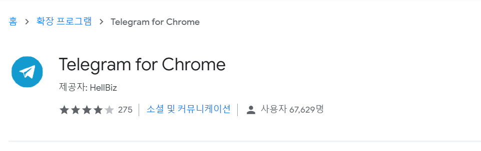
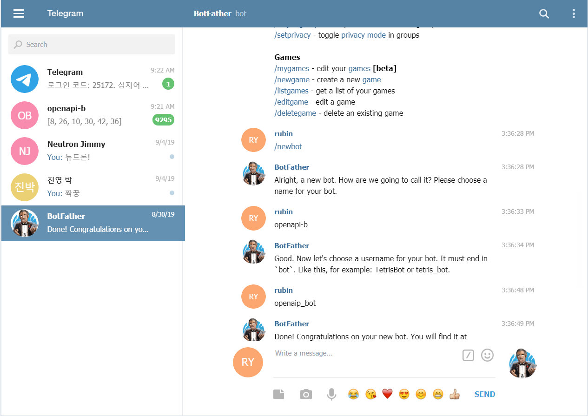
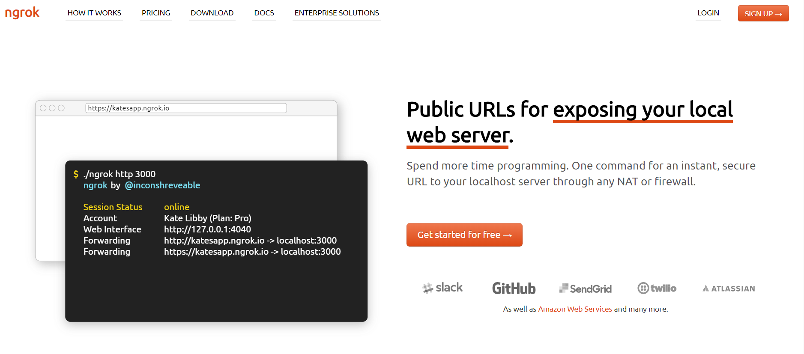
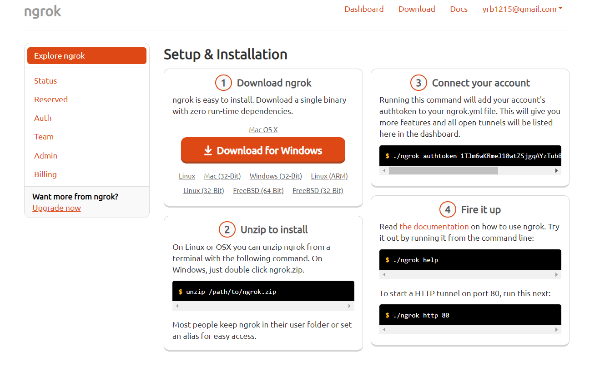
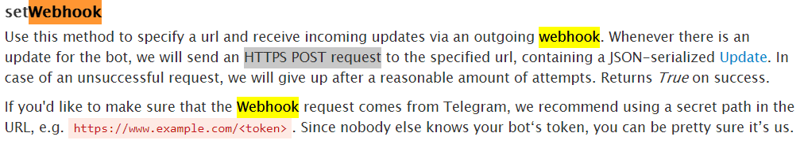

# python 

> [참고]( https://wikidocs.net/book/1 )

: interpreter언어

- 자료형

  1. 숫자형
  2. 문자열 자료형
  3. 리스트 자료형
  4. 튜플 자료형
  5. 딕셔너리 자료형 (~HashMap)
     - in : 포함 여부
  6. 집합 자료형
  7. 불 자료형

- 제어문 **(들여쓰기,`:`)**

  - if 문

    ```
    if 조건문:
        수행할 문장1
        수행할 문장2
        ...
    else:
        수행할 문장A
        수행할 문장B
        ...
    ```

    

  - while문

    ```
    while <조건문>:
        <수행할 문장1>
        <수행할 문장2>
        <수행할 문장3>
        ...
    ```

    

  - for문

    ```
    for 변수 in 리스트(또는 튜플, 문자열):
        수행할 문장1
        수행할 문장2
    ```

## 0. 시작하기

- install python 3.7.5

- install gitbash

- 독립적 가상 환경 구축 (virtual 충돌 방지)

  ```bash
  pip install virtualenv
  ```

- venv folder에 python 3.7 기본환경 생성

  ```bash
  virtualenv venv
  ```

- 가상환경 실행

  ```bash
  source venv/Scripts/activate
  ```

- flask 설치 (python framework)

  ```bash
  pip install flask
  ```

- 파일 생성

- 실행

  ```bash
  env Flask_APP=filename.py flask run
  ```

  - app.py

    ```python
    #-*- coding: utf-8 -*-
    from flask import Flask
    
    app=Flask(__name__)
    
    @app.route('/')
    def hello():
        name="world!!"
        return f'Hello {name}'
    
    if __name__=="__main__":
        app.run(debug=True, port=8000) #자동으로 디버그,포트번호 설정
    
    ```
    
    ```bash
    python app.py
    ```

---

## 1. app.py 실습

### 1.1. basic

```python
from flask import Flask

app=Flask(__name__)

@app.route('/')
def hello():
    name="world!!"
    return f'Hello {name}'

@app.route('/mulcam')
def mulcam():
    return 'Hello multicampus~'

@app.route('/greeting/<string:name>')
def greeting(name):
    return f'{name}님 안녕하세요.'

@app.route('/lotto')
def lotto():
    random_num=random.sample(range(1,46),6)
    return str(random_num)

if __name__=="__main__":
    app.run(debug=True, port=8000) #자동으로 디버그,포트번호 설정
```


### 1.2. tempalte에서 실행

>  `render_template` : HTML파일을 rendering 
>
> `templates` 폴더 아래에  html 파일 생성

- app.py 에서 `render_template(template path)` 을 return 하여 해당 template에서 실행

#### · 점심 메뉴 정하기

- app.py

  ```python
  @app.route('/lunch/<int:num>')
  def lunch(num):
      menu=["낙곱새", "차돌된장찌개", "생고기김치찌개", "한우불고기"]
      order= random.sample(menu, num) #list
      return render_template('menu.html', menu=order) #해당 template에서 실행
  ```

- menu.html

  ```html
  <p>오늘 메뉴는 {{ menu }}</p>
  
  <!-- 범위 지정 endfor -->
   
  ```

#### · query 검색 (google)

- app.py

  ```python
  @app.route('/fake_google')
  def fake_google():
      return render_template('fake_google.html')
  ```

- fake_google.html

  ```html
  <form action="https://www.google.com/search">
      <input type='text' name="query">
      <input type='submit'>
      <!-- query에 입력한 주소가 action을 전송된다. -->
  </form>
  ```

  

### 1.3. 값 호출하기 (request)

- app.py 

  ```python
  from flask import Flask, render_template, request
  
  @app.route('/send')
  def send():
      return render_template("send.html")
  
  @app.route('/receive')
  def receive():
      #flask _ request 사용하여, 내용 수신
      name = request.args.get("name") # nama argument 값을 요청하여 받아온다.
      message = request.args.get("message")
      return render_template("receive.html", name=name, msg=message)
  ```

  - `request` : HTML의 tag name으로 값 요청

- send.html

  ```html
  <form action="/receive" method="GET">
      이름 : <input type="text" name="name"> <br>
      내용 : <input type="text" name="massage">
      <input type="submit" value="전송">
  </form>
  
  <!-- name과 message를 receive경로에 GET method로 전송 -->
  ```

- receive.html

  ```html
  <h1>{{ name }} :  {{ msg }}</h1>
  ```

  

#### · 인디언 이름 찾기

- app.py

  ```python
  from flask import Flask, render_template, request
  
  @app.route('/send_indian')
  def send_indian():
      return render_template("send_indian.html")
  
  @app.route('/receive_indian')
  def receive_indian():
      #flask _ request 사용하여, 내용 수신
      name = request.args.get("name") # nama argument 값을 요청하여 받아온다.
      year = int(request.args.get("year"))
      #selected_year = request.args.get("selected_year")
      month = int(request.args.get("month"))
      day = int(request.args.get("day"))
  
      year_match = ["말 많은", "푸른", "어두운", "조용한", "웅크린", "백색", "지혜로운", "용감함", "날카로운", "욕심많은"]
      month_match = ["늑대", "태양", "양", "매", "황소", "불꽃", "나무", "달빛", "말","돼지","하늘","바람"]
      day_match =["와 함께 춤을","의 기상","의 그림자 속에","","","","의 환생","의 죽음","의 아래에서","을 보라","가 노래하다","의 그림자"] #12개
      
      indian = year_match[(year%10)]+month_match[month-1]+day_match[day-1]
      
      r1= random.choice(year_match)
      r2= random.choice(month_match)
      r3= random.choice(day_match)
      random_name=r1+r2+r3
  
      return render_template("receive_indian.html", name=name, indian=indian, random=random_name)
  ```

- send_indian.html

  ```html
  <form action="/receive_indian" method="GET">
      이름 : <input type="text" name="name"> <br>
      생년월일 : 
      <!-- <select name=selected_year>
      <option value="0">xxx0</option>
      <option value="1">xxx1</option>
      <option value="2">xxx2</option>
      <option value="3">xxx3</option>
      <option value="4">xxx4<option>
      <option value="5">xxx5</option>
      <option value="6">xxx6</option>
      <option value="7">xxx7</option>
      <option value="8">xxx8</option>
      <option value="9">xxx9</option>년
      </select> -->
      <input type="text" name="year">년
      <input type="text" name="month">월 
      <input type="text" name="day">일
      <input type="submit" value="인디안 이름 찾기">
  </form>
  ```

- receive_indian.html

  ```html
  <h3>{{ name }} 님은</h3>
  <h1>{{ indian }} 입니다.</h1>
  <h5>개명 추천 이름 : {{ random }}</h5>
  ```

### 1.4. workshop

#### · lotto 자동 발급, 당첨 확인

> 로또홈페이지->F12->network - xhr => header url & form data

- app.py

```python
@app.route('/lotto_get')
def lotto_get():
    return render_template("lotto_get.html")

@app.route('/lotto_num')
def lotto_num():
    num=request.args.get("num")
    url=f'https://dhlottery.co.kr/common.do?method=getLottoNumber&drwNo={num}'
    res=requests.get(url).json()
    # 1. list comprehension : [받는 변수 for 받는 변수 in 범위로 된 데이터] => list화 되어 return 된다.
    wnum = [ res[f'drwtNo{i}'] for i in range(1,7)]
    print(wnum)

    lotto = random.sample(range(1,47), 6)
    
    match_num = list(set(wnum) & set(lotto)) #집합함수로 변환, 교집합 => list로 변환
    match = len(match_num)
    if match==6:
        msg= '1등입니다.'
    elif match==5:
        msg='2등입니다.'
    elif match==4:
        msg= '3등입니다.'
    else:
        msg= '다음 기회를 노려보세요~'
        
    return render_template("lotto_result.html", num=num, wnum=wnum, lotto=lotto, msg=msg)
```

- `requests` : Python에서 HTTP요청을 보내는 모듈 : url과 파라미터를 연결하여 적절한 새로운 요청을 생성

  - install requests module

    ```bash
    pip install requests
    ```

- lotto_get.html

```html
<form action="/lotto_num" method="GET">
    번호 선택 : <input type="text" name="num">
    <input type="submit" value="회차 선택">
</form>
```

- lotto_result.html

```html
<div>
    회차 : {{ num }} <br>
    당첨번호 : {{ wnum }} <br>
    응모번호 : {{ lotto }} <br>
    결과 : {{ msg }}
</div>
```

---


## 2. Telegram 실습

1. telegram download

   

2. botfather -> api key 생성

   

   ```
   /start
   
   /newbot
   
   bot 이름 설정
   
   rubin-py
   rubinpy_bot
   => API TOKEN GET!!
   ```

3. `.env` file 생성, TOKEN값 저장

   - `decouple` libary 활용하여, Token값 호출 

4. making request [telegram api](https://core.telegram.org/bots/api)

   ```
   https://api.telegram.org/bot<token>/METHOD_NAME
   ```

   - `getMe `:  bot 정보
   - `getUpdates `
     - bot에게 메세지 보낸 후 확인
     - message from 의 id로 나에게 메세지 보내기 가능
   - `sendMessage` : 메세지 발신 가능
     - sendMessage?chat_id=938997511&text=유기농 우유

5. `python-decouple` library 설치 

   ```bash
   pip install python-decouple
   ```

6. `app.py`

   - token 받아오기

   ```python
   from flask import Flask
   import requests
   from decouple import config
   
   
   app=Flask(__name__)
   
   @app.route('/telegram')
   def telegram():
       token=config('TOKEN')
       print(token)
       return ''
       
   if __name__ == "__main__":
       app.run(debug=True) 
   ```


#### · Telegram lotto

```python
@app.route('/telegram')
def telegram():
    token=config('TOKEN')
    base_url = f"https://api.telegram.org/bot{token}"
    res = requests.get(f'{base_url}/getUpdates').json()
    #pprint(res) #요청된 json 확인
    chat_id = res['result'][0]['message']['chat']['id'] #get chat id from json

    #lotto 번호 보내기
    lotto = random.sample(range(1,47), 6)
    sendMessage = f'{base_url}/sendMessage?chat_id={chat_id}&text={lotto}'
    send_res = requests.get(sendMessage).json()
    get_lotto = send_res['result']['text']

    return f'추천 로또 번호 : {get_lotto}'

```

#### · sendMessage

```python

@app.route('/chat')
def chat():
    return render_template('chat.html')

@app.route('/send_msg')
def send_msg():
    req = request.args.get('chat')
    res = requests.get(f'{base_url}/getUpdates').json()
    chat_id = res['result'][0]['message']['chat']['id']
    sendMessage = f'{base_url}/sendMessage?chat_id={chat_id}&text={req}'
    requests.get(sendMessage).json()
    return '보내기 완료'

```

---

#### · webhook

1. download ngrok :  로컬 네트워크 터널이 열린다. (로컬 서버) `공용네트워크제약때문에`





-  `authtoken` 발급 받지않으면 8시간 이용 가능
- `app.py`와 같은 경로에 설치

2. ngrok실행 (새로운 터미널 창~)

   ```bash
   ./ngrok http 5000
   ```

3. webhook file 생성

   - set_webhook.py

     ```python
     from decouple import config
     import requests
     from pprint import pprint
     
     token=config('TOKEN') #decouple library를 활용하여 .env의 token 값을 불러온다.
     base_url = f"https://api.telegram.org/bot{token}"
     url = "6fcfa583.ngrok.io"
     setweb_url=f'/setWebhook?url={url}'
     
     #telegram server에 설정해달라고 요청
     req = requests.get(base_url+setweb_url).json()
     pprint(req)
     ```

     ```
     결과 >
     {'description': 'Webhook was set', 'ok': True, 'result': True}
     (venv)
     ```

     - telegram 서버가 update되면, 요청이 온다.

4. ㅇ

   

   - POST 방식으로 데이터를 받을 수 있다.

   ```python
   @app.route('/', methods=['POST'])
   def tel_wh():
       req =  request.get.json()
       pprint(req)
       return '',200 #200 메세지 return
   ```

   

